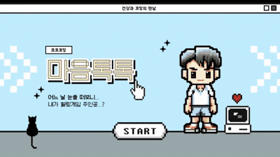
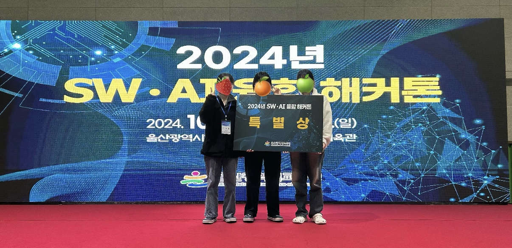

# 🏥 마음톡톡
> 2024 SW·AI 융합해커톤 특별상 수상작  
> 병원에 있는 아동이 질병을 긍정적으로 인식하도록 돕는 2D 감정 기반 RPG 게임

- 2D 캐릭터 이동 시스템
- NPC 대화 시스템 (프리스크립트 기반)
- 감정 선택지 기반 상호작용
- 코인 수집 및 성장 구조
- 목표 중심 진행 방식

 

## **코코코딩 팀**

| 이름 | 역할 |
|------|------|
| 김소연 | Unity 개발 |
| 이채원 | 기획, 대화 시스템 구현 |
| 임나경 | 기획, 도트 디자인, 작곡 |

 

## 💡 문제 인식

병원에 있는 아동은  
질병을 “적” 또는 “두려움”으로 인식하는 경우가 많습니다.

저희 팀은 게임이라는 매체를 통해 감정 표현과 대화를 유도함으로써  
심리적 완화를 돕는 방식을 선택했습니다.

 

## 📈 배운 점
- 제한된 시간 내 MVP 개발 경험
- 감정 기반 게임 설계 방식
- 팀 협업 및 역할 분담
- 해커톤 발표 및 피드백 경험

 

## 🚀 개선할 점

- 멀티 엔딩 시스템 추가
- 저장 기능 구현
- UI/UX 개선

 

 

